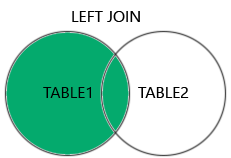

# Performace
 
## 1. Busca por Empresa desnecessária

> app/Http/Controllers/CompanyController.php

❌ No código atual, após a chamada ao método `CompanyUpdate`, é realizada uma busca adicional no banco de dados utilizando `Company::find()`. No entanto, essa busca é redundante, pois o próprio método de atualização (`CompanyUpdate`) já retorna os dados atualizados. Além disso, não há validação de dados, o que torna o uso do `UpdateDomain` questionável. 

✅ A recomendação é remover a busca redundante usando `Company::find()`, e retornar diretamente os dados atualizados após o `UpdateDomain`. Isso economiza um acesso adicional ao banco, simplificando a lógica e melhorando a performance da aplicação. (E, se fizer sentido, remover o UpdateDomain)

## 2. Verificações de dados unicos de forma geral

> app/Repositories/Card/CanUseExternalId.php

❌ O uso de `first()` para verificar a unicidade de dados, pode não ser a abordagem mais eficiente, especialmente em bancos de dados grandes, pois ele retorna o primeiro registro e carrega a entidade inteira na memória.

✅ Utilizar o método `exists()` seria mais eficiente, pois ele realiza apenas uma consulta para verificar se o registro existe, sem carregar os dados completos, melhorando a performance.

## 3. Uso de `innerJoin` para otimizar a consulta

> app/Repositories/Card/FindByUser.php
> app/Repositories/User/Retrieve.php

❌ O `leftJoin` utilizado atualmente pode retornar registros desnecessários da tabela `cards`, mesmo que não haja uma correspondência na tabela `accounts`. Isso pode afetar a performance, especialmente em grandes volumes de dados.

✅ O `innerJoin` é mais eficiente para esse caso, pois ele garante que apenas os registros que têm correspondência nas duas tabelas serão retornados. Isso pode reduzir o número de registros e melhorar a performance da consulta.

## 4. Uso desnecessário de `where` antes do `update`

> app/Repositories/User/Update.php

❌ O uso do `where` para filtrar pela `company_id` antes do `update` é redundante, pois já é feito a atualização de um único registro utilizando o `id` ou outro identificador único passado para o método `update`.

✅ Remover o `where` e deixar o método `update` lidar com a atualização do registro de forma direta e eficiente, já que o `id` ou outro identificador único já é suficiente para localizar o registro a ser alterado.

## 4. Uso desnecessário de `where` antes do `find`

> app/Repositories/User/Find.php

❌ Eu entendo que pode ser uma medida para limitar a usuários que pertencam aquela empresa, mas se o find recebe como parametro um indentificador único, qual a chance de retornar outro usuar de outra empresa?

✅ Remover o `where`
