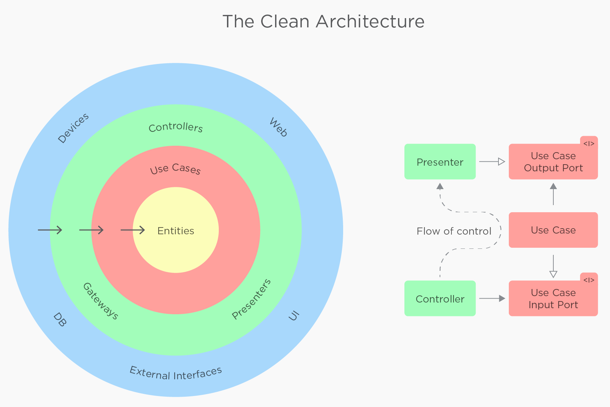

# Injeção de Dependência no Controller


## 1. Problema na criação manual de dependências
> app/Http/Controllers/CompanyController.php
> Isso ocorre em vários outros lugares, esse ponto é aberta para uma discussão geral sobre o projeto

❌ No código atual do método `update`, as dependências são criadas manualmente dentro do método usando o operador `new`. Isso cria um acoplamento forte entre o controller e as implementações concretas (`UpdateDomain`, `CompanyUpdate` e `Company::find`). Essa abordagem torna o código difícil de testar, já que não é possível substituir essas dependências por mocks em testes unitários, além de violar o princípio de inversão de dependência do SOLID.

```php
$dominio = (new UpdateDomain(
    Auth::user()->company_id,
    $request->name,
))->handle();

(new CompanyUpdate($dominio))->handle();

$resposta = Company::find(Auth::user()->company_id)->first()->toArray();
```

✅ A solução recomendada é utilizar a injeção de dependência no construtor ou no método, permitindo que o framework resolva as dependências automaticamente. Isso melhora a testabilidade, seguindo os princípios SOLID, e facilita a substituição de implementações no futuro.

```php
public function __construct(
    private CompanyUpdateInterface $companyUpdate
) {}

public function update(UpdateRequest $request): JsonResponse
{
    // Nem tem sentido chamar o dominio aqui, já que ele não faz nada

    $companyData = $this->companyUpdate->execute($dominio);

    return $this->response(
        new DefaultResponse(
            new UpdateResource($companyData)
        )
    );
}
```

## 2. Falta de interfaces para abstrair implementações

❌ O código não utiliza interfaces para abstrair as implementações concretas. Isso limita a flexibilidade, dificulta testes unitários e cria um forte acoplamento com implementações específicas, violando o princípio de inversão de dependência.

✅ É recomendável criar interfaces para todos os serviços e repositórios. Por exemplo:

```php
interface CompanyUpdateInterface
{
    public function execute(UpdateDomain $domain): array;
}

class CompanyUpdate implements CompanyUpdateInterface
{
    public function __construct(
        private CompanyRepositoryInterface $repository
    ) {}

    public function execute(UpdateDomain $domain): array
    {
        // Implementação...
        return $updatedData;
    }
}
```

As interfaces permitem:
- Substituir implementações facilmente
- Aplicar mocks em testes
- Separar o contrato (o que o serviço faz) da implementação (como ele faz)

## 3. Container de Injeção de Dependência não utilizado
O Laravel possui um poderoso container IoC (Inversion of Control) que pode ser configurado no `AppServiceProvider` para associar interfaces a implementações concretas:

```php
// Em AppServiceProvider.php
public function register()
{
    $this->app->bind(CompanyUpdateInterface::class, CompanyUpdate::class);
    $this->app->bind(CompanyRepositoryInterface::class, EloquentCompanyRepository::class);
}
```

Isso permite que o código seja mais limpo, com menos acoplamento e mais fácil de testar e manter.